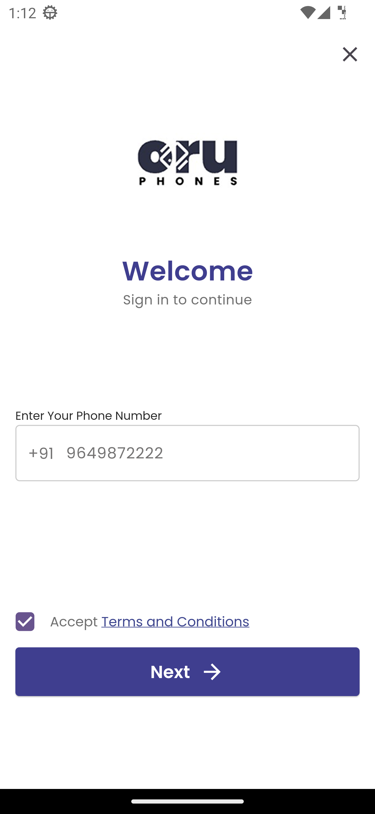
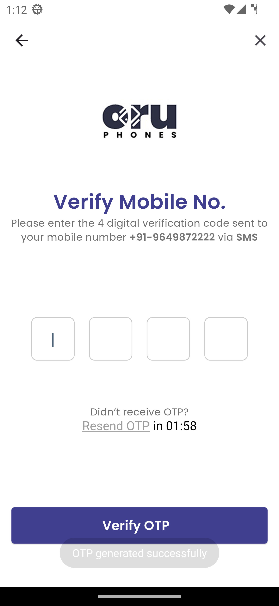
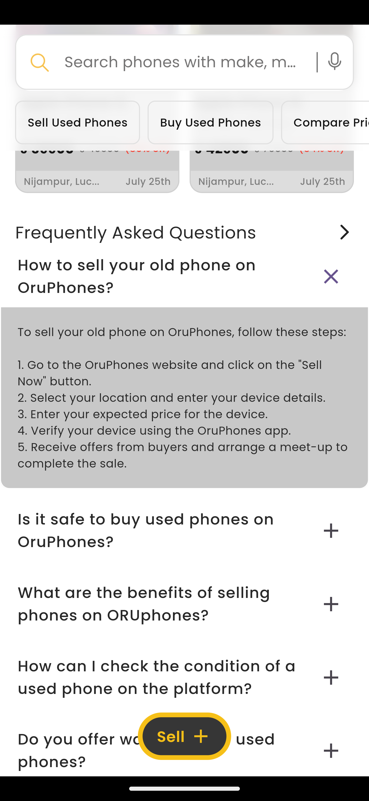
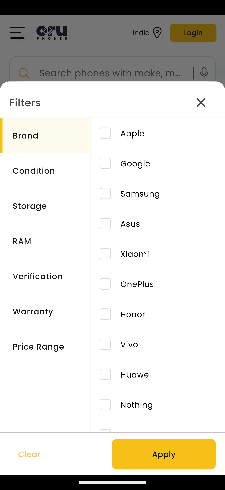
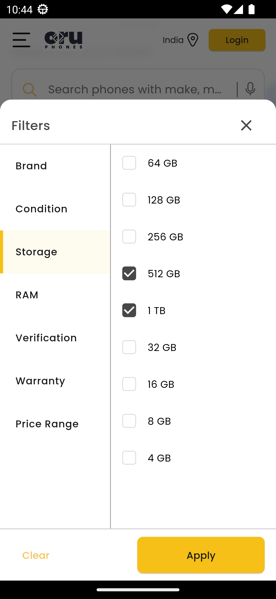
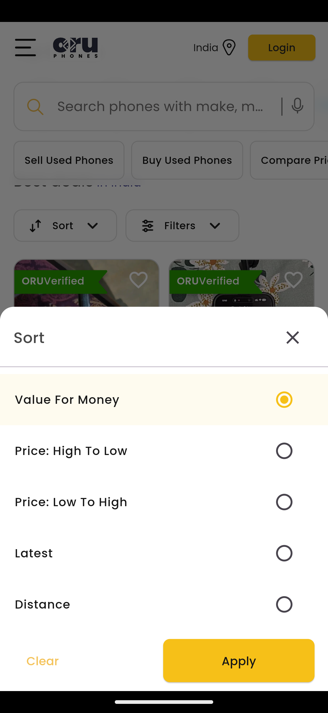
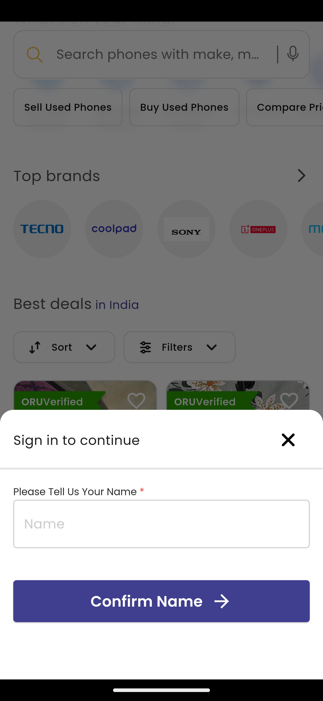
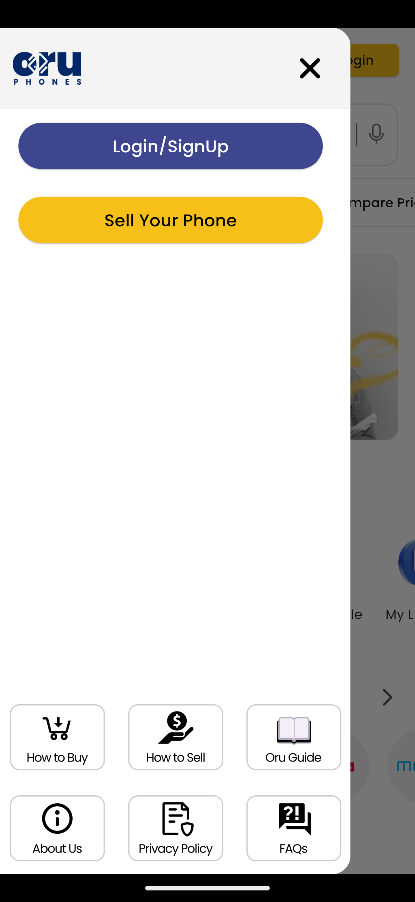
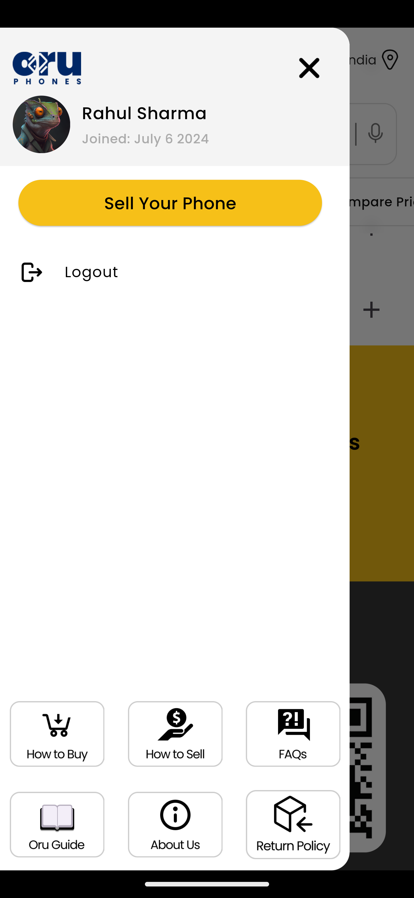

# Mobilicis Task - Flutter Internship Assignment

This project is a Flutter application developed as part of the internship assignment for **OruPhones**. The app includes features such as authentication, a home screen with product listings, and more. The goal of this project is to demonstrate Flutter development skills, state management, and API integration.

---

## Features

### 1. **Splash Screen**

- Checks if the user is authenticated.
- Navigates to the Home Screen or Confirm Name Screen based on the user's authentication status.
- Requests Firebase push notification permissions.

### 2. **Authentication Flow**

- Phone number-based OTP authentication.
- OTP verification screen.
- Confirm Name Screen for new users.

### 3. **Home Screen**

- Displays product cards with pagination.
- Allows users to like listings using heart icons.
- Shows dummy product cards after every 7th listing.
- Implements scrolling behavior similar to the OruPhones app.

### 4. **Bonus Features**

- Uses stacked state management for filters and sorting.
- Implements proper image caching and layout optimization.

---

## State Management

The project uses **Flutter Bloc** for state management, ensuring a clean and scalable architecture. Bloc was chosen for its ability to handle complex state transitions and maintain a clear separation between business logic and UI components.

---

## Architecture

The project follows a **clean architecture** approach, ensuring a structured and maintainable codebase:

- **Presentation Layer**: Contains UI components and Bloc logic.
- **Domain Layer**: Handles business logic and use cases.
- **Data Layer**: Manages API calls, local storage, and repositories.

## Screenshots

### Phone Authentication Screen




### Home Screen










---

## Dependencies

This project relies on the following key dependencies:

- **flutter_bloc**: For state management.
- **dio**: For handling HTTP requests.
- **cached_network_image**: For caching and displaying network images.
- **shared_preferences**: For storing user authentication state locally.
- **freezed**: For generating immutable data classes and union types.
- **json_serializable**: For automatic JSON serialization and deserialization.
- **lottie**: For animations.
- **pinput**: For OTP input fields.

For a complete list of dependencies, refer to the `pubspec.yaml` file.

---

## Setup Instructions

### 1. **Clone the Repository**

```bash
git clone https://github.com/marcolous/Flutter-Mobilicis-Task.git
```

### 2. **Navigate to the Project Directory**

```bash
cd mobilicis_task
```

### 3. **Install Dependencies**

```bash
flutter pub get
```

### 4. **Run the App**

```bash
flutter run
```

Make sure you have a device/emulator running before executing the command.

---

## Contribution

Feel free to fork this repository and submit pull requests for improvements or bug fixes. Contributions are always welcome!

---

## License

This project is licensed under the MIT License.
